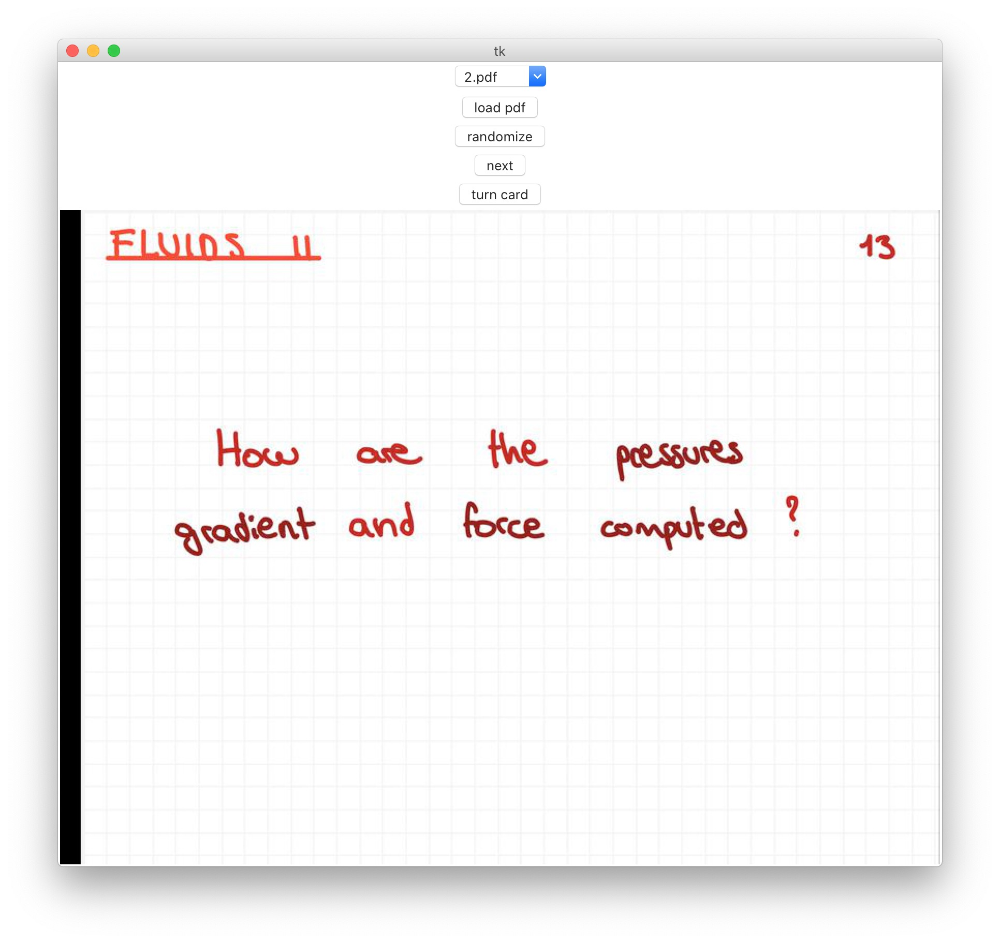

# Flashcard-Viewer
A flashcard viewer that takes as input a pdf file.

I wrote this without knowing any of the libraries (so its probably not optimal at all). 
Improvised in an afternoon in order to visualize my iPad notes as flashcards. 
I made this work using this [pdf template](readme_material/flashcard_h_temp.pdf).
I tested it on my macOs Catalina and on Windows 10 (had an issue, see error section).

Idea
====
-  Finds all the pdfs in the main directory (a bit messy, need change)
-  Can load one pdf in the dropdown menu 
-  Creates images for each page of the pdf and divides the image in 2 (done only once)
   -  The left half of the page is the question
   -  The right half is the answer
-  (conversion is pretty slow, so it might take some minutes if there are a lot of flashcards)
-  Can randomize the order of the cards and visualize the back and the front of each card.

Dependencies
====
- tkinter (`https://tkdocs.com/tutorial/install.html`)
- PyPDF2 (`pip install PyPDF2`)
- PIL (`pip install Pillow`)
- wand (`pip install Wand`)
   - need also ImageMagick: http://docs.wand-py.org/en/latest/guide/install.html
- numpy (`python -m pip install --user numpy scipy matplotlib ipython jupyter pandas sympy nose`)

ERRORS
====
An error I had on Windows 10 after installing all libraries above.
- if you get this error : wand.exceptions.DelegateError: FailedToExecuteCommand `"gswin32c.exe" when you run the main.py script,
then you probably need to install ghostscript (https://www.ghostscript.com/download/gsdnld.html).
I found the solution here (https://stackoverflow.com/questions/32466112/imagemagick-convert-pdf-to-jpeg-failedtoexecutecommand-gswin32c-exe-pdfdel). This worked for me.

- other errors can be caused by not having any pdf in the main directory (have to fix that)
- also if something went wrong when converting the pdf into flashcards remember to always delete the generated directory (that will probably be empty), otherwise the program won't convert the pdf again.

TODO
====
- fix all the small details specified above 
- find better way to convert pdf pages to images
- have a parameter for setting the cut of the pdf (e.g instead of exact middle one can have [0,300] is question and [300,1000])
- allow horizontal cuts
  - in case there are multiple flashcards on a page (e.g. 4 flashcards on an A4 page)

